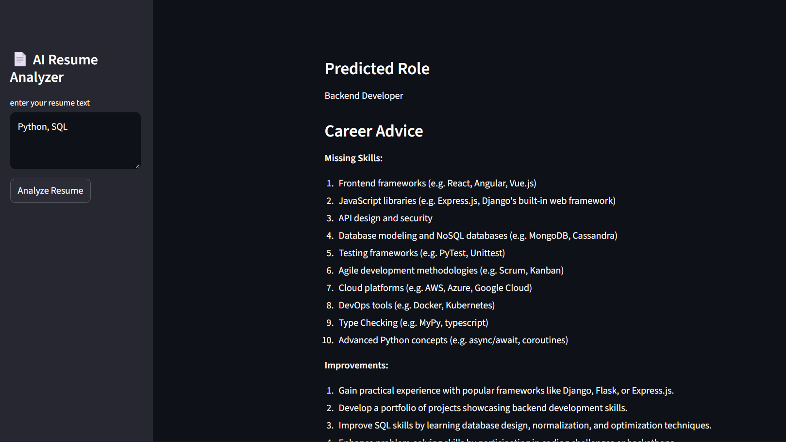

# 🧠 AI Resume Analyzer  
**ML + NLP + LangChain + FastAPI + Streamlit**

---

## 📌 Project Overview

AI Resume Analyzer is an end-to-end beginner-friendly project that demonstrates how to build a complete AI system — not just a model.

The system:
1. Uses **Machine Learning** to predict a suitable job role from resume text  
2. Uses **LangChain + LLM** to generate career advice  
3. Uses an **Output Parser** to keep responses structured  
4. Exposes functionality via an **API**  
5. Displays results in a **Streamlit UI**  

This project focuses on **system thinking**, not model complexity.

---

## 🎯 What the Project Does

### Input  
- Resume text (pasted by the user)

### Output  
- Predicted job role  
- Missing skills  
- Improvement suggestions  
- Learning roadmap  

All results are returned in a clean, structured format.

---

## 🔁 System Flow

User (Streamlit)  
→ API (FastAPI / Flask)  
→ ML Model (Logistic Regression + TF-IDF)  
→ LangChain (LLM Prompt)  
→ Output Parser  
→ API Response (JSON)  
→ Streamlit UI  

---

## 🧩 Tech Stack

### Machine Learning
- Logistic Regression  
- TF-IDF Vectorizer  
- scikit-learn  

### NLP
- Text preprocessing using TF-IDF  

### LLM Layer
- LangChain  
- PromptTemplate  
- Output Parser  

### Backend
- FastAPI (or Flask)

### Frontend
- Streamlit  

---

## 📁 Project Structure

```
resume-ai/
│
├── ml/
│   ├── ml_train.py
│   ├── resume_role_model.pkl
│
├── langchain_app/
│   ├── chain.py
│   ├── parser.py
│
├── api/
│   ├── main.py
│
├── ui/
│   ├── app.py
│
├── data/
│   └── resume_sample_dataset.csv
│
├── requirements.txt
└── README.md
```

---

## 🧠 How It Works (Step-by-Step)

1. User enters resume text in Streamlit  
2. API receives the text  
3. ML model converts text to numbers using TF-IDF  
4. Logistic Regression predicts the job role  
5. LangChain generates career advice based on role + resume  
6. Output Parser enforces structured output  
7. API returns clean JSON  
8. UI displays results  

---

## 🤖 Why Logistic Regression?

- The task is **classification**, not regression  
- Simple, interpretable, and fast  
- Ideal for beginner ML pipelines  
- Keeps focus on architecture and flow  

---

## 🧪 Dataset

The dataset contains two columns:

| Column | Description |
|------|-------------|
| resume_text | Resume content |
| job_role | Target label |

---

## 🚀 How to Run

### 1. Install dependencies
```
pip install -r requirements.txt
```

### 2. Train ML model
```
python ml/ml_train.py
```

### 3. Run API
```
uvicorn api.main:app --reload
```

### 4. Run Streamlit UI
```
streamlit run ui/app.py
```

---

## 📌 Learning Outcomes

- Understand how text becomes numbers (TF-IDF)  
- Apply ML classification in a real system  
- Use LangChain for controlled LLM usage  
- Enforce structured AI output  
- Build API + UI integration  

---

## ⚠️ Limitations

- Small dataset  
- Simple ML model  
- No authentication or database  
- Intended for learning, not production  

---
## Project UI



## 🏁 Final Note

This project is about building a **complete AI pipeline**, not chasing accuracy.

If you can explain every step of this system, you’ve moved beyond beginner level.
